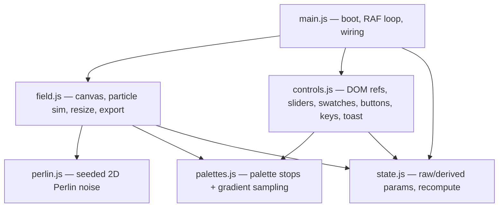

# refactor: Aether — modular structure, UI polish, mobile optimization, Cloudflare Pages deploy

## Summary

`aether.html` is a single 533-line file holding the markup, CSS, and JavaScript for a canvas-based generative vector-field instrument (Perlin flow field, particle line-trails, palette swatches, a slider console, keyboard shortcuts, and PNG export). This plan splits it into a clean, zero-build static project (separate HTML, CSS, and native ES modules), wires the project to the GitHub repo `mikeascendx/aether` so progress is tracked, applies a targeted UI polish pass, makes the control surface genuinely usable on tablets and phones, and ships a plain-text Cloudflare Pages deployment guide built around GitHub → Pages git integration.

The instrument's **behavior must not regress** — the split is a behavior-preserving refactor verified by visual/functional parity. The UI work is a polish pass on the existing dark/serif aesthetic, not a rebrand.

---

## Problem Frame

Everything lives in one file, which makes the project hard to navigate, hard to diff meaningfully on the GitHub timeline, and hard to extend. The mobile experience is degraded-by-hiding: below 760px the telemetry, corner marks, and hint are simply `display:none`, the console grid collapses to 2 columns, and `user-scalable=no` plus a desktop-sized glass console make the controls cramped and the canvas interaction unclear on touch. There is no deployment path documented.

Goals:
1. Organized, idiomatic static structure (HTML / CSS / JS modules) with no build step.
2. Connect to `github.com/mikeascendx/aether` for progress tracking.
3. Polish the desktop UI without losing its identity.
4. First-class tablet + phone experience (reachable controls, working touch interaction).
5. A `.txt` Cloudflare Pages deployment guide.

Non-goals: framework migration, backend, new instrument features, changing the generative algorithm.

---

## Requirements

- **R1** — Functional parity: the modular version renders, animates, and responds (sliders, swatches, mode toggle, pause, clear, randomize, export, keyboard shortcuts, cursor force) identically to the current single file.
- **R2** — Zero-build: the site runs by opening `index.html` / serving the folder statically; no bundler, transpiler, or Node toolchain required.
- **R3** — Native ES modules: JS is split into focused modules loaded via `<script type="module">`.
- **R4** — Repo wired: project committed and pushed to `github.com/mikeascendx/aether`.
- **R5** — Desktop UI polish: refined spacing, control affordances, and visual consistency on the existing aesthetic.
- **R6** — Mobile/tablet usability: controls reachable and operable on phones and tablets; canvas touch interaction works; no degraded-by-hiding of essential controls.
- **R7** — Cloudflare Pages deploy guide as a `.txt` file, based on GitHub → Pages git integration.

---

## Key Technical Decisions

- **Zero-build native ES modules over a bundler.** `aether.html`'s script is a single IIFE with clean internal seams (noise, palettes, simulation, UI, boot). Native `<script type="module">` splits it cleanly with no toolchain, which is the lowest-friction path to Cloudflare Pages (Pages serves a static folder directly; no build command needed). Trade-off: ES modules require serving over HTTP (not `file://`) during local dev — documented in the README via a one-line static server. Confirmed direction in scoping.
- **`index.html` at repo root.** Cloudflare Pages serves `index.html` from the output root by default; keeping it at root means the deploy config is "no build, root output" — the simplest possible Pages setup.
- **Polish, not redesign.** The current dark/serif/glass aesthetic is intact and intentional; UI work sharpens it (touch targets, spacing rhythm, control legibility) rather than restyling. Confirmed in scoping.
- **Mobile: relayout, don't hide.** Replace the `display:none` mobile rules with a responsive console (e.g., collapsible/scrollable control sheet, larger touch targets) and re-enable sensible zoom semantics. Keep telemetry optional but accessible rather than fully removed.
- **Module boundaries** mirror the existing IIFE's internal structure so the refactor is mechanical and parity is easy to verify (see High-Level Technical Design).

---

## High-Level Technical Design

Target module dependency graph (native ES modules, no bundler):



Rationale for the seams (all already present as comment-delimited blocks in `aether.html`):
- `perlin.js` — `perm` table, `fade`/`lerp`/`grad`/`perlin2` (lines ~283–304). Pure, no DOM.
- `palettes.js` — `PALETTES`, `BG`, `BG_SOLID`, `sampleGradient` (lines ~270–311). Pure data + function.
- `state.js` — `state` object + `recompute()` (lines ~332–351). Shared mutable state.
- `field.js` — canvas refs, `paintSolid`, `resize`, particle lifecycle (`makeP`/`respawn`/`initParticles`), the `frame()` loop, `exportPNG` (lines ~313–404, 504–512).
- `controls.js` — `el` DOM map, swatch build, `setPalette`/`setMode`/`setPaused`, label/slider sync, listeners, `randomize`, `flash` toast (lines ~406–519).
- `main.js` — boot sequence (lines ~521–530) importing and wiring the above.

---

## Output Structure

```
aether/
├── index.html              # markup only; loads css + main.js module
├── css/
│   └── aether.css          # all styles extracted from <style>
├── js/
│   ├── perlin.js           # seeded 2D Perlin noise (pure)
│   ├── palettes.js         # palette data + gradient sampling (pure)
│   ├── state.js            # shared params + recompute()
│   ├── field.js            # canvas, particle simulation, resize, export
│   ├── controls.js         # DOM wiring: sliders, swatches, buttons, keys, toast
│   └── main.js             # boot + RAF loop
├── README.md               # what it is, local dev (static server), controls
├── .gitignore
├── CLOUDFLARE-PAGES-DEPLOY.txt  # deployment guide
└── docs/
    └── plans/              # this plan
```

The tree is a scope declaration of the expected shape; the implementer may merge `state.js` into `field.js` if the cross-module sharing proves awkward. Per-unit `**Files:**` remain authoritative.

---

## Implementation Units

### U1. Scaffold structure, move markup, wire GitHub repo

**Goal:** Establish the directory layout, extract the HTML body into `index.html` (markup only, with placeholder `<link>` and `<script type="module">` references), and connect the project to `github.com/mikeascendx/aether` with an initial commit.

**Requirements:** R1, R2, R4

**Dependencies:** none

**Files:**
- `index.html` (create — markup from `aether.html` `<body>`, head with `<link rel="stylesheet" href="css/aether.css">` and `<script type="module" src="js/main.js">`)
- `.gitignore` (create — OS cruft, editor dirs, `*.png` exports)
- `aether.html` (retain until U2/U3 confirm parity, then delete in U3)

**Approach:** Copy the `<head>` (fonts, meta, title) and full `<body>` markup verbatim into `index.html`. Replace inline `<style>` with a stylesheet link and inline `<script>` with a module script tag (CSS/JS files filled in U2/U3). Initialize git, set remote to the named repo, push initial commit. Keep `aether.html` in place this unit so the page still works after CSS/JS are extracted and parity-checked.

**Patterns to follow:** preserve existing `<head>` exactly (font preconnect/link, viewport — viewport revisited in U5).

**Test scenarios:** `Test expectation: none -- scaffolding/markup move, no behavioral change.` Parity verified after U3.

**Verification:** Repo exists on GitHub with the initial commit visible; `index.html` contains the full markup with external CSS/JS references.

---

### U2. Extract CSS into `css/aether.css`

**Goal:** Move the entire `<style>` block into `css/aether.css` unchanged.

**Requirements:** R1, R2

**Dependencies:** U1

**Files:**
- `css/aether.css` (create — contents of the current `<style>` block, lines ~11–199)
- `index.html` (already links it from U1)

**Approach:** Verbatim extraction — no rule changes this unit (polish is U4, responsive is U5). Keep `:root` custom properties, keyframes, and the existing `@media (max-width:760px)` block intact for now.

**Execution note:** Characterization-first — confirm visual parity before any later styling change touches this file.

**Test scenarios:** `Test expectation: none -- verbatim style extraction.`

**Verification:** Page styled identically to the original `aether.html` when served (compare side-by-side screenshots at desktop width).

---

### U3. Split JavaScript into ES modules

**Goal:** Extract the single IIFE into the modules defined in the High-Level Technical Design, wired via `import`/`export`, loaded by `js/main.js`.

**Requirements:** R1, R2, R3

**Dependencies:** U1, U2

**Files:**
- `js/perlin.js` (create — noise; export `perlin2`)
- `js/palettes.js` (create — export `PALETTES`, `BG`, `BG_SOLID`, `sampleGradient`)
- `js/state.js` (create — export `state`, `recompute`)
- `js/field.js` (create — export canvas init, `resize`, `initParticles`, `frame`, `paintSolid`, `exportPNG`)
- `js/controls.js` (create — export a `bindControls`/`initUI` entry that wires DOM + listeners)
- `js/main.js` (create — import all, run boot sequence)
- `aether.html` (delete once parity confirmed)

**Approach:** Mechanical extraction following the existing comment-delimited blocks. The IIFE's shared closure variables become module-level state in `state.js` plus exports. `el` DOM map and listener registration live in `controls.js`; the RAF `frame()` loop and canvas drawing live in `field.js`; `main.js` reproduces the existing boot order (`resize` → `setPalette(0)` → `syncSliders`/`syncLabels` → `initParticles` → seed cursor motion → `requestAnimationFrame(frame)`). Preserve `"use strict"` semantics (modules are strict by default). Watch the cross-module references: `field.frame()` reads `state` and writes `el.tFps`; keep those wired.

**Execution note:** Characterization-first — extract one module at a time, re-verifying the page still runs after each, since modules have no test harness and parity is the only safety net.

**Patterns to follow:** keep function names and the boot sequence identical to ease parity diffing against `aether.html`.

**Test scenarios:** Manual functional parity (no automated harness in a vanilla static project):
- Page loads served over HTTP; field animates; particles trail and respawn.
- Each slider (particles, flow scale, velocity, persistence, cursor force) updates its label and affects the field.
- Each palette swatch sets palette + `--accent`; active swatch marked.
- Mode toggle button and canvas click both flip attract/repel; telemetry + button label update.
- Pause/resume, clear, randomize all work; randomize re-seeds all params + palette + mode.
- Keyboard: space=pause, r=randomize, c=clear, e=export, h=toggle UI.
- Export downloads `aether-field.png`; toast shows.
- Cursor force disturbs particles within radius; pointerout disables force.
- Resize re-fits canvas without breaking the loop.

**Verification:** All scenarios above pass when served via a local static server; `aether.html` deleted; only modular files remain and the page is byte-for-byte behaviorally equivalent.

---

### U4. Desktop UI polish pass (frontend-design)

**Goal:** Sharpen the existing aesthetic — spacing rhythm, control affordances, legibility, hover/active states — without changing identity or layout intent.

**Requirements:** R5

**Dependencies:** U2, U3

**Files:**
- `css/aether.css` (modify)
- `index.html` (modify only if markup hooks are needed, e.g., wrapping a control group)

**Approach:** Run the polish through the `ce-frontend-design` skill against the live page. Likely targets: consistent control vertical rhythm in `.console__grid`, clearer slider thumb/track contrast, swatch label legibility, button focus-visible states for keyboard/accessibility, and tightening the telemetry/wordmark type scale. Keep palette-driven `--accent` theming. No new color identity.

**Test scenarios:** `Test expectation: none -- visual styling; validated by screenshot review.`

**Verification:** Before/after desktop screenshots reviewed; no functional regression (re-run U3 interaction checks); focus-visible states present for interactive controls.

---

### U5. Mobile + tablet responsive and touch optimization

**Goal:** Replace degraded-by-hiding mobile rules with a usable responsive control surface and working touch interaction across phones and tablets.

**Requirements:** R6

**Dependencies:** U4

**Files:**
- `index.html` (modify — viewport meta; possibly a console toggle affordance)
- `css/aether.css` (modify — responsive breakpoints for phone + tablet)
- `js/controls.js` (modify — touch interaction; optional console show/hide toggle)
- `js/field.js` (modify if touch-move handling needs adjustment)

**Approach:**
- **Viewport:** reconsider `maximum-scale=1.0, user-scalable=no` — keep pinch behavior sensible; the canvas is full-bleed so accidental zoom is the concern, but disabling zoom hurts accessibility. Decide between allowing zoom vs. `touch-action` on the canvas only.
- **Tablet (≈481–1024px):** show the console in a comfortable layout (e.g., 3-col grid), keep telemetry, larger touch targets (sliders/buttons ≥44px hit area).
- **Phone (≤480px):** console becomes a bottom sheet or scrollable panel with a toggle to collapse it so it doesn't cover the field; controls remain reachable; corner marks/hint may stay hidden but controls must not be removed.
- **Touch interaction:** the canvas currently uses pointer events (`pointermove`/`pointerdown`) which cover touch, but `touch-action` and page-scroll interception need handling so dragging on the canvas disturbs the field without scrolling the page; tapping flips mode. Ensure the boot's `'ontouchstart' in window` branch still seeds motion correctly.

**Test scenarios:** (manual, on emulated + real devices)
- Phone portrait: all five sliders reachable and draggable; buttons tappable; console can be collapsed to reveal the full field.
- Tablet portrait/landscape: console legible, telemetry visible, controls comfortably sized.
- Touch-drag on canvas disturbs the field and does not scroll/bounce the page.
- Single tap on canvas flips attract/repel.
- Orientation change re-fits canvas (resize handler) without breaking the loop.
- Pinch-zoom behaves per the decided viewport policy.

**Verification:** Tested at representative breakpoints (e.g., 375×667 phone, 768×1024 tablet, 1024×768 tablet landscape) via browser device emulation and at least one real touch device; controls operable; canvas touch works; no horizontal scroll.

---

### U6. Cloudflare Pages deployment guide (`.txt`)

**Goal:** Plain-text, step-by-step guide to deploy this repo to Cloudflare Pages via GitHub git integration, so every push updates the live site (the requested progress timeline).

**Requirements:** R7

**Dependencies:** U1 (repo wired)

**Files:**
- `CLOUDFLARE-PAGES-DEPLOY.txt` (create)

**Approach:** Document the git-integration path: Cloudflare dashboard → Workers & Pages → Create → Pages → Connect to Git → authorize GitHub → select `mikeascendx/aether` → production branch `main` → **Framework preset: None**, **Build command: (empty)**, **Build output directory: `/`** (root, since `index.html` is at root and there is no build) → Save and Deploy. Include: the resulting `*.pages.dev` URL, how automatic deploys on push work, preview deployments for branches/PRs, optional custom domain steps, and a troubleshooting note (ES modules require correct MIME `text/javascript` — Pages serves `.js` correctly by default; assets must use relative paths). Plain text only, no markdown formatting since it's a `.txt`.

**Test scenarios:** `Test expectation: none -- documentation artifact.`

**Verification:** Following the guide produces a working live deployment at a `pages.dev` URL; a subsequent `git push` to `main` triggers an automatic redeploy.

---

### U7. README

**Goal:** Project README covering what Aether is, the controls/shortcuts, local dev (must be served over HTTP for ES modules), structure, and a deploy pointer.

**Requirements:** R2 (documents the HTTP-serving constraint), R4

**Dependencies:** U3, U6

**Files:**
- `README.md` (create)

**Approach:** Concise: one-paragraph description, controls table (cursor/click/keys), "run locally" with a one-line static server command (e.g., `python -m http.server` or `npx serve`), the module structure, and a link to `CLOUDFLARE-PAGES-DEPLOY.txt`.

**Test scenarios:** `Test expectation: none -- documentation.`

**Verification:** Local-dev instructions actually serve the working page; links resolve.

---

## Scope Boundaries

**In scope:** structural split, ES modules, GitHub wiring, desktop polish, mobile/tablet responsive + touch, Cloudflare Pages `.txt` guide, README.

**Deferred to Follow-Up Work:**
- Bundler/minification pipeline (only if perf or asset count later justifies it).
- Self-hosting the Google Fonts to remove the external dependency.
- PWA/offline support, settings persistence (localStorage), shareable URL state.

**Outside this scope:** new instrument features or algorithm changes; framework migration; any backend.

---

## Risks & Dependencies

- **ES modules over `file://` fail** (CORS). Mitigation: README documents serving over HTTP locally; Cloudflare Pages serves over HTTP in production so no impact there.
- **Parity regressions during the JS split** (closure → module state). Mitigation: characterization-first per-module extraction (U3 execution note); keep names/boot order identical for easy diffing against `aether.html`.
- **Mobile viewport/accessibility tension** (`user-scalable=no` vs. zoom). Mitigation: U5 makes an explicit, documented decision rather than inheriting the current setting.
- **External dependency:** Google Fonts CDN — unchanged from current behavior; flagged as a deferred follow-up to self-host.

---

## Sources & Research

- Primary source: full read of `aether.html` (single file, 533 lines) — structure, seams, and behavior catalogued in the High-Level Technical Design.
- Cloudflare Pages static/git-integration deploy is a stable, well-documented path (no build, root output for a static `index.html`); user named it explicitly. No external research was load-bearing for this plan.
